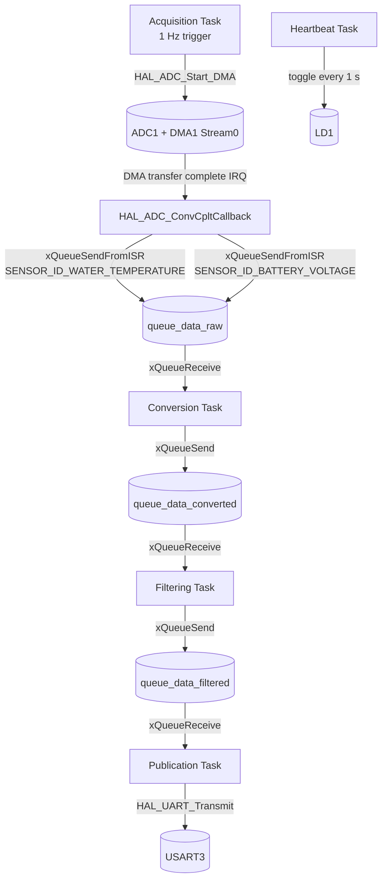
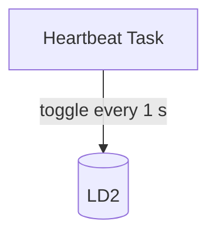

# 🛻 T3 Dash -- Digital dashboard for the VW T3

(C) 2026 Matthias Schär, Rinaldo Leone, Timon Burkard

This is a project work part of the CAS Embedded Systems at FHNW Brugg-Windisch.

## FW

### Nucleo

#### M4

#### M7

